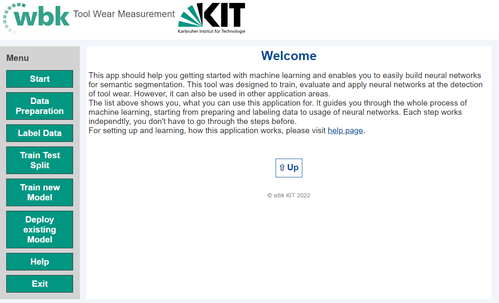

Wear Tool Measurement
===

---
# Introduction to the topic
The goal of the Wear Tool Measurement is to detect, classify, and predict wear in chipping tasks. These chipping tasks are Turning and Milling Processes.

The detection and classification process is done by Image Recognition with DLL models (UNet).

**BAUMER CAMERA**:
The camera used for the Image Recognotion is the BAUMER ....
It runs on an UNIX OS (Ubuntu ...) and has its own API for interface. Examples for the API can be found under `/baumer_api`. It can be accessed by importing the `neoapi` library.
The drivers for the camera and the libraray can be downloaded on the Baumer Website: https://www.baumer.com/de/de/produktubersicht/industriekameras-bildverarbeitung/software/baumer-neoapi/c/42528.

The Models for the Turning Process have not been trained on the Baumer Camera yet. This might impose problems in the implementation so far. The camera used for the Turning Process was a **Dino-Lite Digital-Microscope** (...).

## Turning Process

## Milling Process
For the Milling Process, the code is running on a *Baumer ...* Camera. 

The Milling Process bares its own parameters. These can be found in the sketch down below. These parameters are an important information when classifying the wear. 

***Insert sketch of Parameters and Images of wear with parameters***

---

# Navigating Through The Application

In the beginning it has to be mentioned that the current version differs from the initial version in case of data selction. Where as in the beginning the image folder has had to be selected, now the system is *project based*. This means, differnt so called 'projects' can be created and referenced for data processing, model training, and prediction.

These projects need to be loaded with initial raw data, like images and masks (see down below). What data is used for what task is then defined by the 'project' that has been selected.

## How To Start The App?

To start the app in its current status, a small serious of steps have to be done before.

1. **Starting the Camera**
The Code, at least for the Turning process, runs on the *Baumer ...* camera. The special Ubuntu OS is set to auto-start when the camera is provided with a ... current. This means, once turned on, the camera restarts itself every time it is turned off.
2. **Activating The Environment**
When the system is running, the *Virtual Environment* containing all the necessary packages for the wear application must be activated. 
In the current version, this has to be done by *deactivating* the `base` environment and activating the `...` environment.
This is achieved by openeing the Terminal and ....
    > `source deactivate`
    > `source activate`
3. **Executing the Program**
Once the Virtual Environment is activated, the main file has to be executed. The main file can be found at *`INSERT PATH TO MAIN.PY ON THE SYSTEM`*.
The `main.py` file then executes the `index.html` file, starting the HTML surface. The surface then will open in the Browser defined in the `main.py` file.
4. **Closing the Program**
The program can be closed by closing the window of the Browser the application is running in. If this is not possible, the system needs to be restarted entirely, and you must proceed with step 1 again.

Once the program is running, the output on the Browser should look like this:

The left side provides the user with a way of navigating through the application. The content of the different sites will be explained further on.

---

## How To Prepare Data?

The data the program can process are images of each sizes. To have a segmentation result, *Masks* of these images are also needed. These masks are the *Ground Truth* of every image, displaying the area of the wear. This is the process of **Semantic Segmentation** (see: https://de.mathworks.com/solutions/image-video-processing/semantic-segmentation.html).
These masks have to be created by hand. Best practice is using the *MatLab Image Labler* (content of *Image Processing Toolbox*). 
**Documentation on how to do it**

The final images and masks should be stored in the filesystem under `/images/raw_images` or `/masks/raw_masks` within a *new folder*.

In the *Data Preparation* tab, the images can be resized to a more fitting size. Furthermore, they can be aligned or cropped.
The process is fully automatic and needs the raw image data as input. It automatically creates subfolders within the selected project.

For resizing, the desired image size can be set in the *Image height* and *Image width* input. The input of which is the number of pixels, so the resolution of the image. Additionally, the number of channels can be altered. 
*Channels* mean the depth of the image arrays. So, for `grayscaled` images, the depth of the array would be `0`, for `RGB` images `3`, and for `CMYK` images `4` (see: https://medium.com/featurepreneur/understanding-the-concept-of-channels-in-an-image-6d59d4dafaa9).

The alignment process works with the ... algorithm. 

Another important pre-processing step is the cropping of images. Due to computational expenses, a smaller image is desirable. With the high resolution of the Baumer Camera a bigger aspect ration and image size is inevitable. To maintain this high resolution with the reduction of uninteresting parts, only the relevant part of the image is cropped out and used.

Another function that is useful in the pre-processing is the Mask-Conversion. It converts the 'black' images that are exported from the MatLab ImageLabler to black and white images.

## How To Train A New Model?

To understand the training of a Neural Network see the following lecture:
- https://towardsdatascience.com/an-introduction-to-neural-networks-with-implementation-from-scratch-using-python-da4b6a45c05b
- Explaination of  Train Test Split philosophy:
https://machinelearningmastery.com/train-test-split-for-evaluating-machine-learning-algorithms/
- Train Test Split Documentation: 
https://scikit-learn.org/stable/modules/generated/sklearn.model_selection.train_test_split.html

The training of a new model can be done in the *Train New Model* tab. Here, one can select between a *Normal Mode* and an *Expert Mode*.

The *Normal Mode* provides the user with the basic functionality needed to train a new model.
To train a new Neural Net, the input parameters set by the user are the *name of the new model*, the *number of classes*, the *validation size*, *augmentation settings*, and *training parameters*.

The number of channels must be identical to the channels of the masks used for the training. For a Binary Sematic Segmentation, as used in the models for now, the number of challes has to be 2.

The Validation Size determines how big of a portion of the data is used for training and how much data for testing. A bigger Validation Size, means less data for training and more for testing. The values range from 0 to 1, indication percentage. A value of 0.25 is sufficient for most data sets. This depends on the size of the data used, however.

For augmentation, rotation, images shifting, zooming, and flipping can be set. Augmentation makes the model training more robust. Keep in mind that this goes along with additional computational expenses since 'more images are being created'.

The *Expert Mode* further dives in to the model training. Images are usually set to be in a certain aspect ration after cropping in the pre-processing. This aspect ration has a static default values of 512x512, however this might change depending on the decisions made in the pre-processing. The pixel ration of the input images must always align with the size of the input layer of the model. Therefore, an adjustment towards the input layer can be made in the expert mode.

Additionally, the *Model Training Parameters* need further settings too. In Easy Mode, the user can only adjust the number of epochs. Regarding the size of the data set or the validation size selected, the batch size of the model training needs to be adjusted as well. It corresponds with the number of epochs and the number of images used in the training.

To tackle overfitting, the option to use Early Stopping is also necessary. See Early Stopping: https://machinelearningmastery.com/early-stopping-to-avoid-overtraining-neural-network-models/

## How To Segment An Image?

To make preditions on an image the *Segmentation* tab is implemented. 

Offline predictions work on a single image only. By selection the image source on the right side of the page and loading it from the file, it is displayed on the GUI.

The model that should be used for the prediction must also be selected. The specific HDF5 file must be selected. They can be found in the file system under `models/*process*/project_name*`. After loading the model, the 'Segmentation' button is enabled and the segementation can be done. The results of the segmentation can then be saved to the file system.

---

## Where Can I Find Help?

This section has not been updated yet.

---
---
# Explaination to the code

## Structure
The code is structured into a *HTML frontend* and a *Python backend*. These are connected through the *Eel* library.
The frontend is hosted on a local server and displayed in the Browser. Every interaction can be done over this interface.
The backend provides all the function and computations. This includes especially the model training and segmentation of the images.

## Python Libraries
For the installation of the necessary libraries it is best practice to create a virtual environment. Herefore, **Anaconda** provides all the necessary tools, whilst being easy to use. 
- A documentation on how to install Anaconda can be found here: https://docs.anaconda.com/free/anaconda/install/index.html (Installation Guide)

- An introduction to Anaconda can be found here: https://conda.io/projects/conda/en/latest/user-guide/tasks/manage-environments.html#activating-an-environment (Creating a new environment)

Anaconda itself provides a User Inferface which is kind of self explainatory.

The libraries needed for the program can be found in the table below. All of them should be installable through `python pip`. It is important, that some libraries are not downwards compatible, and therefore require a certain order in which they are installed.
Since the versions of these libraries may or may not change the dependecies towards other libraries, it is best practice to take an empty environment, run the code, and install the packages regarding to the errors that appear.

| Package | Command | Used for |
|---|---|---|
|OpenCV (Python) | `pip install opencv-python` | Image Processing Operations|
| Tensorflow |`pip install tensorflow` | Machine Learning Functions|
| Eel |`pip install Eel` | Interface Between Python And HTML|
|SciKit-learn |`pip install scikit-learn` | Machine Learning Functions |
| Pillow |`pip install Pillow`| Image Processing Operations |
| Pandas |`pip install pandas` | Data Processing Operations |
| matplotlib |`pip install matplotlib` | Data Displaying Operations|

## Folder Structure
The folder structure can be found below. The main code for execution is located in the code directory. Inside, it is divided into the backendcode, directly inside the `code` folder, and the forntend part inside its designated folder.
Important documents and explainations can be found in the `docs` folder. 

The pretrained models are stored inside the `models` directory. It is split into a `milling` and a `turning` part, representing both currently implemented processes. Models get saved as a file on their own and can be called accordingly.

The images and masks for training are stored in the `training_images` and `training_masks` folders. For every image, a mask exists with the same name as the image. 

- baumer_api
    - docs
    - examples
    - tools
- code
    - frontend
        - img
- data_training
    - milling
        - *project 1*
            - images
                - augmented
                - cropped
                - final
                - img
                - resized
            - masks
                - ...
        - ...
    - turning
        - ...
- docs
- models
    - milling
    - turning
- saved_images

---
---
# HTML Frontend
Same structure as the backend

Frontend Variables:

General Variables:

---
---
# Python Backend
The Python Backend provides all the calculations and functions the frontend cannot do. This includes especially the machine learning algorithms, image manipulation, and system-code-communication, like saving and loading files.

## Execution of the backend [`main.py`]
The entire application is started by executing the `main.py` file. The function it initializes with is the `start_app()` function, which fires up the HTML interface over the Eel library. It gathers the path to the directory on the system, and executes the `index.html` file with the Eel extension after navigating into the `frontend` folder. The parameter `mode` can be altered regarding the Browser the applicant wants to use.

Besides the main execution of the application, the `main` file provides function to the following:

- **Camera Functions**
The Camer is implemented under the `cameraBaumer.py` or `cameraSystem.py` file, but still has to be called and initialized in the `main` function. The following functions make use of the interface to the camera.
    - **Creating Video Stream** `videoFeed()`
    Location: `main.py`. To create a live Video Stream of the tool the python backend provides an extension to the JavaScript code, acting as an interface between camera and frontend. Therefore, a `VideoCamera` object has to be created [`cameraSetup()`] and a Video Stream must be generated with the `videoStream()` function. The images streaming from the camera then are encoded into `blob` format (***B**inary **L**arge **OB**ject*), so the data can be passed to the JavaScript code with the Eel extension.
    - **Generating Video Stream** `videoStream(camera = VideoCamera)`
    This function generates a Video Stream with the help of the `VideoCamera` object, created in either one of the camera APIs (see down below). The Camera is initialized based on the system the code is running on. If the Baumer API is installed, meaning the system is executed on the Baumer Camera, the `main` file is loading the camera program fit for the Baumer Camera. If this is not the case, the regular Windows or Linux extension is called. Here, the *Camera Channel* of the specific system the code is running on has to be defined (usually between 1 and 3).
    - **Taking A Picture** `takePicture()`
    To take a foto the `takePicture()` function uses the globally defined varaiables `filename`, `relevantImage`, and `cameraConnection`. The `cameraConnection` variable has been set before in the camera implementation (see above). The other two variables are set by this function and provide the filename and image data the image is handled with. Furthermore, through the`eel` extension, the image, encoded into blob format, is passed to the HTML interface.

- **Loading and Saving Images and Models**
The segmented images are stored in the `saved_images` folder, while the trained models are stored in the `models` folder. 
    - **Loading An Image** `loadImage(path: str)`
    A general function, that can be used to load images from a directory is provided with the `loadImage` function. The input it takes in the *path to the file* in form of a string. It accesses the global variable `filename` as path, and assignes the global `relevantImage` variable the new image data. By encoding the image data to `blob` format, the image data is exposed to the HTML interface over the `updatePicture` function.

    - **Save An Image** `saveImages()`
    *NOT YET IMPLEMENTED*
    Saves global `mask` variable and an image of the segmentation result to the directory over path input. The picture is saved with year, month, date, hour, minute, and second as filename. 

    - **Loading A Model** `loadModel(path: str)`
    Loading the model from the saved directory is done in the same manner as with the images. It takes in the *path to the  directory* the model is stored in. The function set the global `myModel` variable for the keras object of the model by initializing a new `segmentation.Model` object. 

    - **Save A Model** `saveModel()`
    **Needs more context**

    - **Selcting A File** `getFile(elementId: str)`
    The same procedure as in the `get_directory` function, but with `Tkinter` waiting for a file selection instead of a directory.

    - **Selecting A Directory** `getDirectory(elementId: str)`
    To load, for example the model, over the HTML interface, a path string to the directory needs to be acquired. This can be acvhieved through an extra directory interface with the `getDirectory` function. This function creates a `Tkinter` window, displaying the file explorer, and exposing the directory string to the according HTML element (e.g. text input) via the designated `elementId`.

- **Preprocessing**
*Interface to Data Preprocessing Site*
*TBD*
    
- **Model Training** 
*Interface to HTML Trainig Site*
    - **Training New Model** `trainModel(parameters)`
    Takes in the parameters from the parameter input in the HTML surface, turns them into a dictionary, and trains model with the `modelTraining.trainModel` with it (see *Training New Model*).
    - **Evaluate Training Of The Model** `evaluateModel(multiclass: int, parameters)`
    *Needs Updated Information*
    Grabs the parameters from the parameters from the parameter input in the HTML surface, turns them into a dictionary, and evaluates them either as with the `evaluateTraining.multiclass_evaluation` when the input paramter `multiclass` is passed as `1` (True), or with the `evaluateTraining.binary_evaluation` when `multiclass` is passed as `0` (False).
    The return values of these functions are the *metrics* of the model, that are passed onto the HTML interface over the `eel` extension to the `outputMetric` function.

- **Segmenting An Image**
    - **Image Segmentation** `segment_image()`
    The segmentation applies the global variable for the pre-loaded model `myModel` onto the selected image `relevantImage` (also global variable). 
    In the first step, the model height width is compared with the image dimensions. If this is not the case, the function aborts and throws an error, asking for the right image size input.
    Next, the channels of the image are adjusted to the model input with the help of the `generalUtensils.adapt_channels` function (see *Helpful Functions*).
    In the third step, the segmentation is done by applying the `segmentation.Model.segment` on the image. 
    In the last step, the segmentation is evaluated by creating a `resultSegmentation.WearCluster` object with the masks of the segmentation result and applying its `wearClustering` function. The final mask of the wear segmentation, that indicates the boundaries of the wear, is displayed using `resultSegmentation.WearCluster.visualizeCluster`.
    In the end, the mask is passed to the HTML surface for display and the segmentation is evaluated using `resultSegmentation.wearWidth`.
    - **Live Segmentation** `liveSegementation()`

- **Unused Interfaces**
These interfaces have been used for the calibration of the **CAMERA BEFORE BAUMER** camera, but have been removed from this version. The functions can be found on other branches GitHub.
    - `readCalibration Parameter()`
    - `calibrateDistances(distance)`
    - `getPos(x1: int,x2: int,y1: int,y2: int)`
    - `tryOut()`

## Accessing the different cameras [`cameraSystem.py`, `cameraBaumer.py`]
camera implementation (and Baumer API)
## Helpful functions [`generalUtensils.py`]
general utensils
## Data Preparation [`datapreparation.py`, `perspective.py`]
data preparetion (and how to create masks) [data preparation, perspective, ]
### Data Preparation
### Perspective

## Training new model 
### `modelTraining.py`
### `evaluate_training.py`
### `U_Net_Model.py` 
### `U_Net_Model_v2.py`

model training (and explaination of the model) [modelTraining, evaluateTraining, U_Net_Model, U_Net_Model_v2]
## Segmenting an image 
### `segmentation.py`
### `segmentation_v2.py`
### `segmentation_test.py`
### `resultSegmentation.py`

segmentation [segmentation, segmentation_v2, segmentation_test, resultSegmentation]
